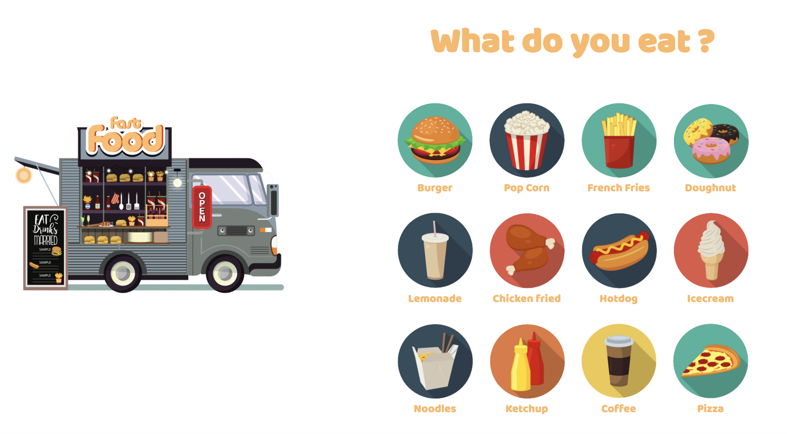

Utilisation du framework Express pour développer une page Web 👾

<h1 align="center">foodtruck</h1>

<h2 align="center">
  
</h2>

# Les fonctionnalités développées :

👉 Mise en place de la mécanique permettant, au clic sur le produit commandé, d’afficher le html du fichier food.ejs avec l’information dynamique contenant le nom du produit commandé
